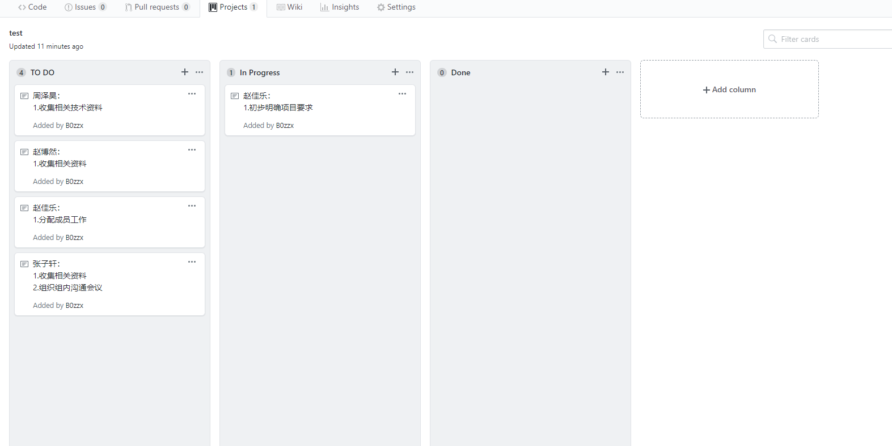
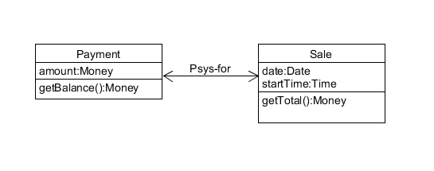

# Homework 2
## 16340297 张子轩
### 一、简答题

+ 用简短的语言给出对分析、设计的理解。
    - 分析强调的是对问题和需要的调查研究，而不是解决方案；
    - 设计强调的是满足需求的概念上的解决方案（在软件方面和硬件方面），而不是其实现；

+ 用一句话描述面向对象的分析与设计的优势。
    - 能够构建与现实世界相对应的问题模型，并保持它们的结构、关系和行为模式。

+ 简述 UML（统一建模语言）的作用。考试考哪些图？
	- UML的作用：
		- UML是一种开放的方法，用于说明、可视化、构建和编写一个正在开发的、面向对象的、软件密集系统的制品的开放方法。
	- 考试考的图：
		- 用例图、静态图、行为图、实现图。

+ 从软件本质的角度，解释软件范围（需求）控制的可行性
    - 由于软件本身的复杂性、不可见性、不一致性、可变性，软件范围多数情况下对于客户和开发者都是模糊的，这形成软件产品与其他产品不同的开发过程。由于大部分客户都没有思考清晰的业务，实现起来是十分低效的，我们可以先忽略这些业务，优先去实现那些用户切实需要的最基本的业务。再在之后的迭代中，根据用户需求的逐渐清晰，加入并完善其它业务。
---
### 二、项目管理实践

+ 看板使用练习：

    

 ---
### 三、UML绘图工具练习
+ UML和模式应用（第三版）P103:

    
 
