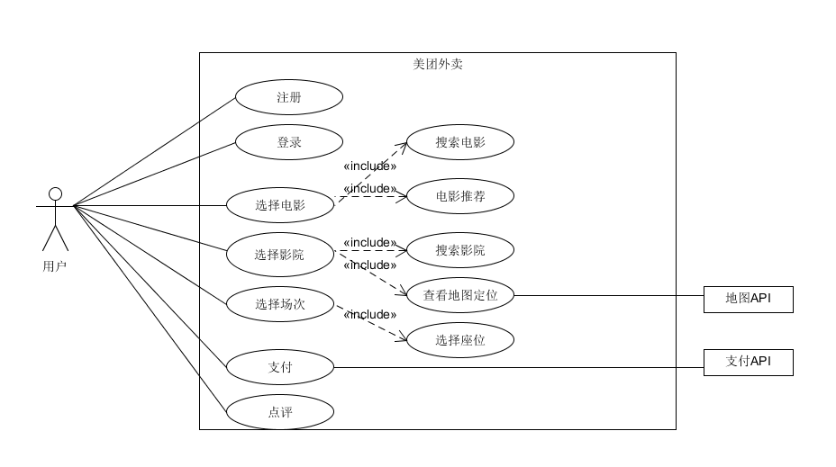
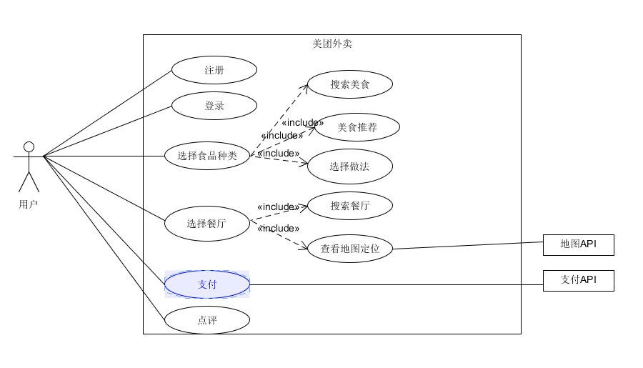

# Homework 6
## 16340297 张子轩
### 一、简答题

1. 用例的概念

    + 在不展现一个系统或子系统内部结构的情况下，对系统或子系统的某个连贯的功能单元的定义和描述。

2. 用例和场景的关系？什么是主场景或 happy path？

    + 关系：每个用例提供了若干个被用来说明系统如何与其他对象进行交互的场景。

    + 主场景：主要的场景，用来说明系统与其他对象的主要交互。

3. 用例有哪些形式？

    + Brief、Casual、Fully。

4. 对于复杂业务，为什么编制完整用例非常难？

    + 复杂业务所具有的场景过多或过复杂，很难完整编制。

5. 什么是用例图？

    + 用例图是指由参与者（Actor）、用例（Use Case），边界以及它们之间的关系构成的用于描述系统功能的视图。

6. 用例图的基本符号与元素？

    + 小人---参与者。
    + 圆框---用例。
    + 方框---系统边界。
    + 箭头---各种关系（关联、包含、继承、泛化）。

7. 用例图的画法与步骤

    + 设置系统边界。
    + 确立参与者。
    + 确立用例以及用例间的关系。
    + 添加外部系统接口。

8. 用例图给利益相关人与开发者的价值有哪些？

    + 明确需求。
    + 规划开发。
    + 便于项目开发的管理与控制。

### 二、建模练习题（用例模型）

1. 选择2-3个你熟悉的类似业务的在线服务系统（或移动 APP），如定旅馆（携程、去哪儿等）、定电影票、背单词APP等，分别绘制它们用例图。并满足以下要求：

    + 请使用用户的视角，描述用户目标或系统提供的服务
    + 粒度达到子用例级别，并用 include 和 exclude 关联它们
    + 请用色彩标注出你认为创新（区别于竞争对手的）用例或子用例
    + 尽可能识别外部系统和服务

    

    

2. 然后，回答下列问题：
    + 为什么相似系统的用例图是相似的？

        - 相似的系统所要实现的功能以及业务逻辑相似，用例图也就相似。

    + 如果是定旅馆业务，请对比 Asg_RH 用例图，简述如何利用不同时代、不同地区产品的用例图，展现、突出创新业务和技术

        - 加强评星算法，使用新的算法，结合价格、消费水平、用户评价、实地情况等信息进行评分，让用户可以方便地选择优质旅馆。

    + 如何利用用例图定位创新思路（业务创新、或技术创新、或商业模式创新）在系统中的作用

        - 通过研究创新思路所对应的创新用例与其他用例之间的关系来定位。

    + 请使用 SCRUM 方法，选择一个用例图，编制某定旅馆开发的需求（backlog）开发计划表

        ID | NAME |  Imp | Est | How to demo  
        -|-|-|-|-
        1 | 注册 | 8 | 3 | 用户进行账号注册
        2 | 登录 | 8 | 3 | 用户进行账号登录
        3 | 搜索酒店与房间 | 10 | 4 | 用户可以通过搜索查询酒店
        4 | 预定 | 10 | 5 | 用户选择想要的房间进行预定
        5 | 支付 | 10 | 5 | 用户通过多种支付方式支付金额
        6 | 查看订单 | 7 | 2 | 用户可以查找已订房间

    + 根据任务4，参考 使用用例点估算软件成本，给出项目用例点的估算

        用例 | 事务 |  计算 | 原因 | UC权重  
        -|-|-|-|-
        注册 | 2 | 3 |  | 一般
        登录 | 2 | 3 |  | 简单
        搜索 | 3 | 4 |  | 一般
        预定 | 4 | 4 |  | 复杂
        支付 | 4 | 4 |  | 复杂
        查看订单 | 2 | 2 |  | 简单

